# 实验报告

## 一、实验题目
线上书店设计（包括前台用户系统和后台管理系统，类似当当书城）


## 二、开发环境
* 系统环境： Windows10
* 数据库： [SQLite3](https://www.sqlite.org/index.html)（ Pycharm 自带?）
* 语言： [Python](https://www.python.org/)
* IDE： [Pycharm](https://www.jetbrains.com/pycharm/)
* Web 开发： [Django](https://www.djangoproject.com/)
* 前端框架： [MDUI](https://www.mdui.org/)


## 三、数据库设计

* 用户相关
```python
#  User 模块
# 其实还想往里面加类似评论，用户头像啥的东西，但是这就过于内卷了（虽然写起来很方便）
class User(models.Model):
    username = models.CharField(max_length=30, primary_key=True)
    password = models.CharField(max_length=256)
    # 加盐的 MD5 保护
    salt = models.CharField(max_length=256)
    email = models.EmailField(unique=True)
    phone = models.CharField(max_length=11, unique=True)
    c_time = models.TimeField(auto_now_add=True)

    def __str__(self):
        return self.username

    #加入用户购物车
    def add_to_cart(self, book, number):
        try:
            order = BookOrder.objects.get(book=book, cart=self)
            order.quantity += number
            order.save()
        except BookOrder.DoesNotExist:
            new_order = BookOrder.objects.create(book=book, cart=self, quantity=number)
            new_order.save()

    # 移除出购物车
    def remove_from_order(self, book):
        try:
            order = BookOrder.objects.get(book=book, cart=self)
            order.delete()
        except BookOrder.DoesNotExist:
            pass

    # 购物车总额计算
    def total(self):
        orders = BookOrder.objects.filter(cart=self)
        total = 0
        count = 0
        for order in orders:
            total += order.book.price * order.quantity
            count += order.quantity
        context = {
            'total': total,
            'count': count
        }
        return context

    # 返回所有订单
    def get_all_order(self):
        orders = BookOrder.objects.filter(cart=self)
        return orders

    # 付款并将记录存入账单（Finance）
    def pay(self):
        orders = BookOrder.objects.filter(cart=self)
        total = 0
        for order in orders:
            total += order.book.price * order.quantity
            order.book.inventory -= order.quantity
            order.book.save()
            order.delete()

        finance = Finance.objects.create()
        finance.function = finance.func.sold
        finance.executor_role = finance.role.user
        finance.sum = total
        finance.person_id = self.username
        finance.save()

    class Meta:
        ordering = ['c_time']

# 用户购物车
class Import_Order(models.Model):
    clerk = models.ForeignKey(Clerk, models.DO_NOTHING)
    book = models.ForeignKey(Books, models.DO_NOTHING)
    import_price = models.DecimalField(decimal_places=2, max_digits=10)
    quantity = models.IntegerField(default=10)
```

* 书本相关
```python
 # Book 设计
class Category(models.Model):
    cate_id = models.PositiveSmallIntegerField(primary_key=True, verbose_name='category id')
    name = models.CharField(unique=True, max_length=256)

    class Meta:
        ordering = ['cate_id']


class Books(models.Model):
    # need check ISBN == 11
    ISBN = models.CharField(primary_key=True, max_length=11)
    title = models.CharField(max_length=100)
    # maybe more than 1 author.... I don't care
    author = models.CharField(max_length=100, default='anonymous')
    publisher = models.CharField(max_length=100, default='anonymous')
    publish_date = models.DateField()
    # 书本介绍，类似于前言之类的，总之就是广告啦
    advertise = models.CharField(max_length=1000)
    price = models.DecimalField(decimal_places=2, max_digits=6)
    # 货存量（不允许任何人修改，只能在调用特定函数时，在函数内部增减）
    inventory = models.IntegerField(default=0)
    # 图书封面
    cover = models.FileField(upload_to='static/common/book_cover')
    # 分类是个一对多关系，所以就 ForeignKey 了 （虽然这可以是个多对多，比如一本书属于多个分类）
    cate_id = models.ForeignKey(Category, models.CASCADE, default={'cate_id': 0})
```

* 职员相关
```python
class Clerk(models.Model):
    sex = (
        ('male', 'Male'),
        ('female', 'Female'),
        ('other', 'Other')
    )

    clerk_id = models.CharField(max_length=11, primary_key=True)
    password = models.CharField(max_length=256, default='SBPJ')
    salt = models.CharField(max_length=256)
    email = models.EmailField(unique=True)
    phone = models.CharField(max_length=11, unique=True)
    gender = models.CharField(max_length=10, choices=sex, default='Male')
    # clerk创建时间
    c_time = models.TimeField(auto_now_add=True)
    # 限制模式限制
    active = models.BooleanField(null=False, default=False)
    
    # 这里的想法是不允许 signup 只能通过 superuser 创建后使用 default 密码跳转到改密中心
    def default_password(self):
        return 'sbpj'+self.clerk_id


# add by super user
# 接下来是粒度控制（后台管理系统的粒度控制）
"""
现在实现了以下 4 个权限控制
1. role_name：
   menu_name:
   role_menu_url:

"""
class Role(models.Model):
    # 建议的 group 名称
    role_name = models.CharField(max_length=256)
    # 在页面根据具体用户所拥有的权限，动态生成的菜单名称
    menu_name = models.CharField(max_length=256, null=False, default='Edit Book', unique=True)
    # 和动态加载相关的东西（就是每个目录对应的菜单）
    role_menu_url = models.CharField(max_length=256, null=False, default='1')
    # 每个目录详情介绍（用于维护）
    info = models.TextField()

    def get_sub_menu(self):
        sub_menu_list = Permission_cate.objects.filter(role=self)
        return sub_menu_list

# 每个 group 对应的子目录
class Permission_cate(models.Model):
    role = models.ForeignKey(Role, models.CASCADE)
    sub_menu_url = models.CharField(max_length=10)
    name = models.CharField(max_length=256)


# many to many model
# 连接 clerk 和 Role 的多对多联系集
class Clerk_Role(models.Model):
    clerk = models.ForeignKey(Clerk, models.CASCADE)
    role = models.ForeignKey(Role, models.CASCADE)
```


* 账单（不可以直接修改的内容）
```python
    #  账单
class Finance(models.Model):

    # 进账人员的确定
    class role(enumerate):
        user = 1
        clerk = 2

    # 进账方式
    class func(enumerate):
        sold = 1
        buy = 2

    # 进账方式
    function = models.IntegerField(null=False, default=func.sold)
    # 进账人员
    executor_role = models.IntegerField(null=False, default=role.user)
    # 本次交易总额
    sum = models.DecimalField(null=False, decimal_places=2, max_digits=10, default=0)
    # 交易时间
    date = models.DateField(auto_now_add=True)
    # 交易人员信息
    person_id = models.CharField(max_length=30, null=False, default='missing')

    class Meta:
        ordering = ['date']
```


## 四、系统设计

### 用户功能设计

#### login，signup 界面
* 实现了大部分网站类似的 login 和 signup ，密码用 MD5+salt 的形式保存在数据库用户端
  
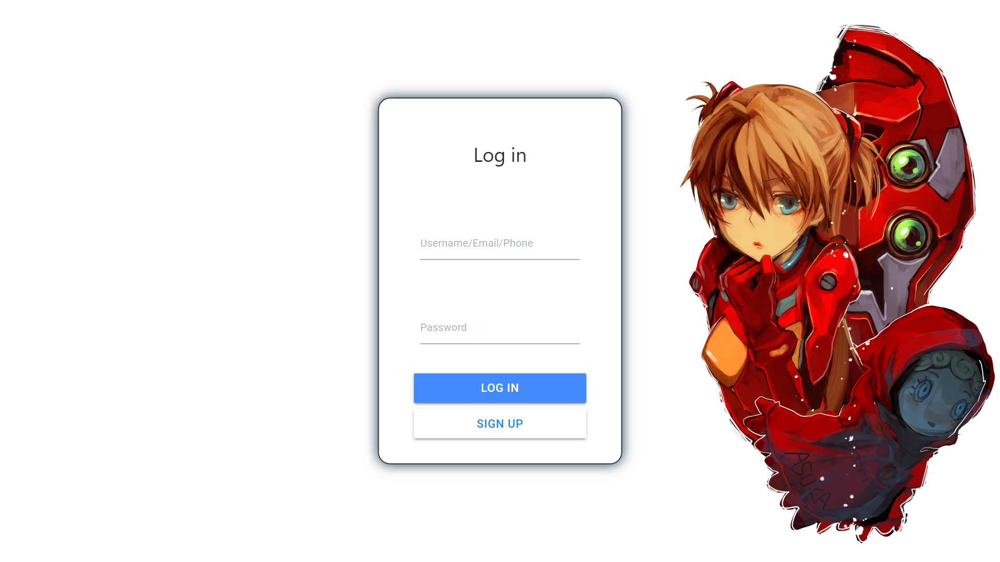

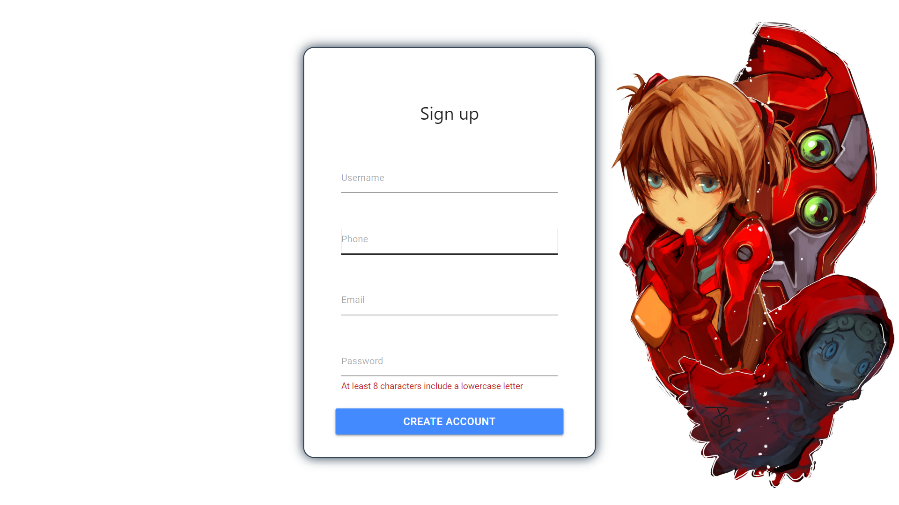

----

#### library/index 
* 书店所有书本的展示，侧边栏加载书籍分类，可以点击不同分类，查看该分类下的书本
* 页面右上角的查找框实现了对书库书本的模糊搜索（包括 isbn，title，author，publisher 的模糊查找）
* 点击书本 card 跳转到书本的详细页面，里面有书本的详细内容（下面介绍）
* 右上角 logout 的标签就是简单的用户退出键，点击后直接退回登录界面
* 以及旁边的是用户购物车，点击跳转到 cart 中
  
  

----

#### library/book_detail
* 左侧是书籍封面，右侧是书籍的详细信息和购买选项
* 点击按钮加入购物车
* ps：本来想在右侧导航栏里写个用户中心什么的，但是这个过于内卷，所以就没去实现了（容易实现，但是没必要去倒腾这种没有实质性提升的功能）
  
  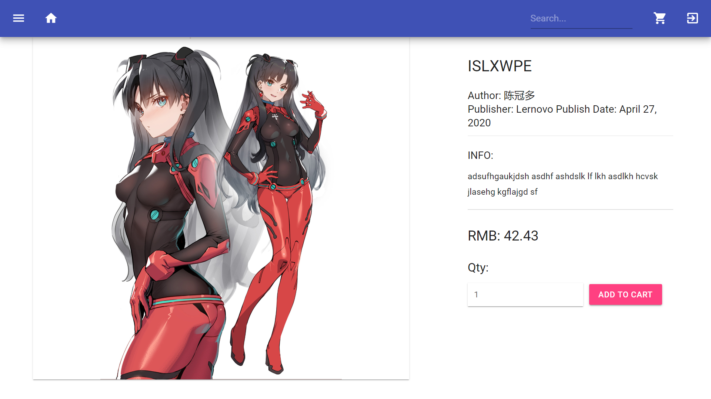

---

#### library/cart
* 购物车具体内容，用列表的形式展现了购物车内的东西
  
  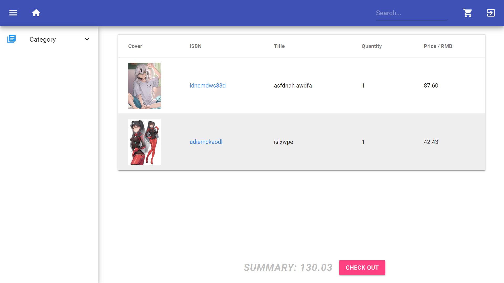
* 点击列表右侧 **-** 键，将物品移除购物车 ( 这里是没更改前的照片，更改后加上了“垃圾桶” )
* 点击底部导航栏的 **checkout** 付款，届时会弹出对话框（嗯，就是我的支付宝付款码，没想到吧），点击 confirm 付款成功，跳转回 index 界面

  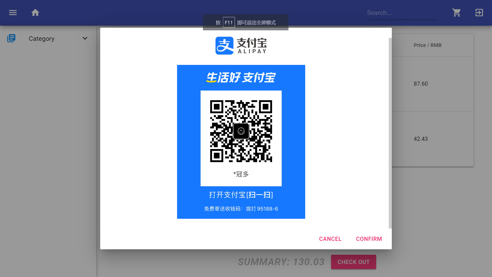

---
---

### Clerk 界面

#### clerk/login， signup
* clerk 没有显式 signup 界面，只能通过高级管理员注册一个带有初始密码的员工账号，并通过 login 界面输出初始密码后点击 **log in** 才能进入密码修改界面（也就是所谓的 signup）
  
  
  clerk login

  
  clerk change password

---

#### clerk/index 
* 所有拥有 clerk 账户的人都能看见的页面， 展现的是公司总账
  
  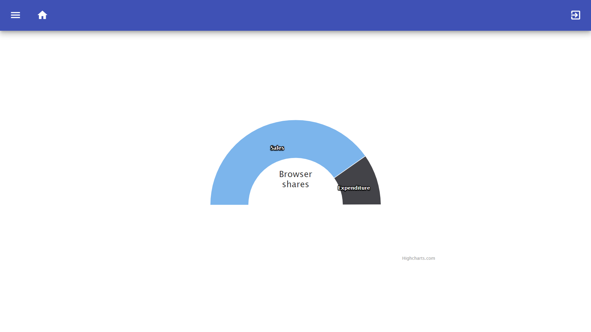
* 顶部导航栏从左到右分别是：侧边导航栏引出按钮， 主页按钮，退出按钮
  
  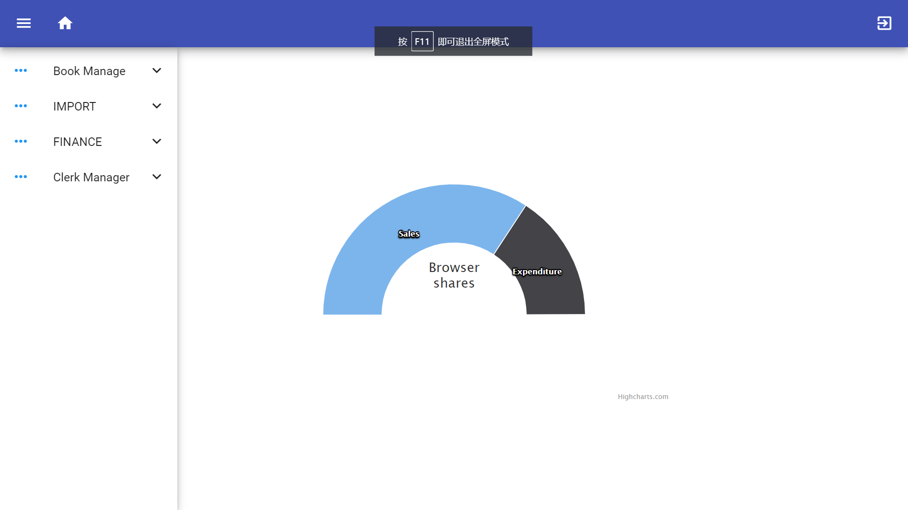
* 侧边导航栏将根据用户所有的权限动态加载可访问的区域有： 书本管理，增加订单，账单查询，group 添加

---

#### clerk/book edit
* 列表形式展现书籍现状，点击 edit 键进入书本编辑，点击 + 键弹出对话框增添书籍，点击搜索键对书本模糊查询
  
  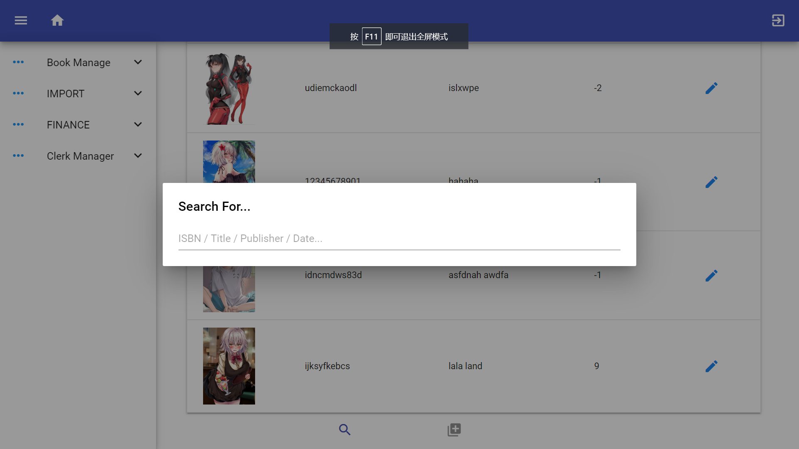

  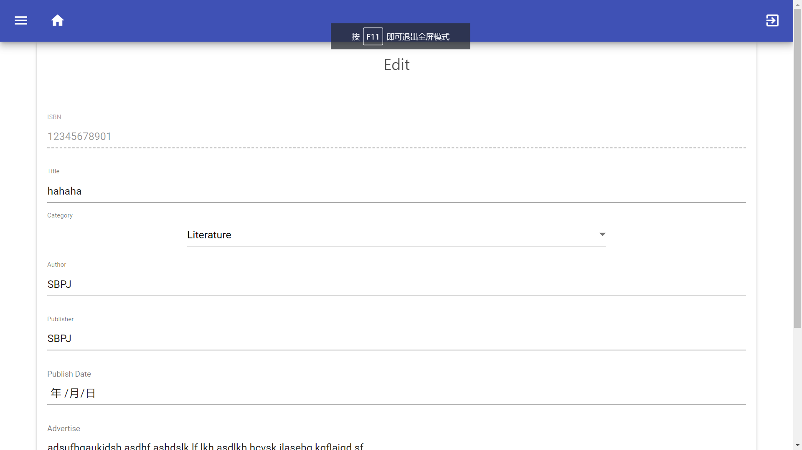

  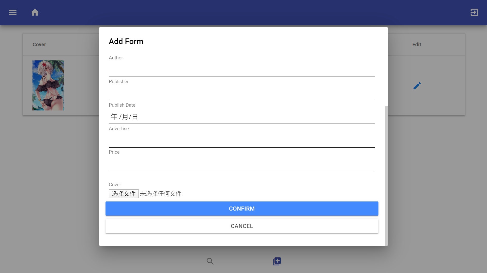

---

#### clerk/import
* 点击 + 好弹出对话框选择要买入的的书本, 其中有选择书本、选择数量和进货的单价（默认如果书店里没有这个书就不能进货，毕竟是电子商城，没库存的书也可以预告对吧）
  
  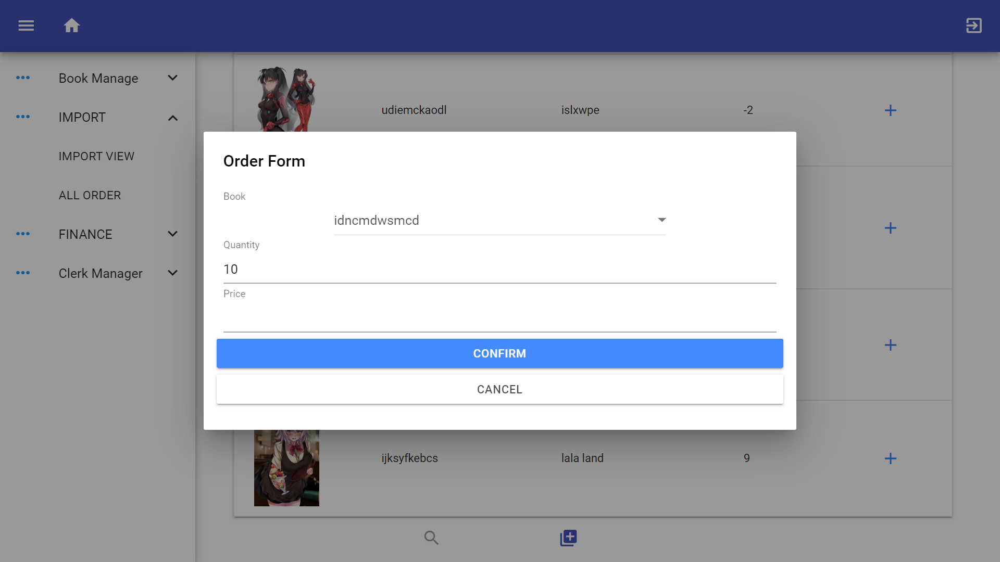
* 果断的拒绝加入进货中间态这个奇怪的选项（为什么你书店进货是在自己的网页上进货啊？写在网上的这个功能不应该是个记录用的功能嘛？总觉得加入很奇怪没有违和感，就拒绝加入了，嗯）
* import order detail 里面就是看看自己的进货单之类的，然后可以删除进货单，类似用户 cart 界面，但是不显示总额（因为没必要）, 然后可以查找订单 （ 实现的也是模糊搜索 ）
  
  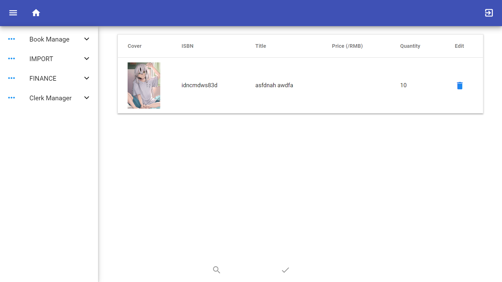

---

#### clerk/finance
* 就是按照时间和类型顺序排放的表单，由于觉得在这里加一个查找键很丑，所以就没加进去 （ 查找特定时间的可以写，但是丑就算了，我室友 wws 的查找函数就是我帮他的，千万别说出去）
  
  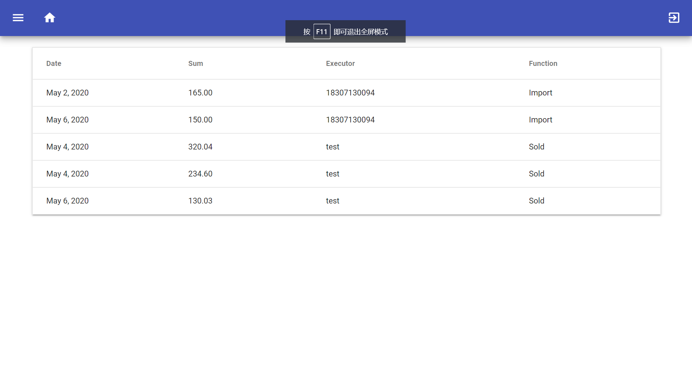


#### clerk/manage
* （这个界面最下面那个 + 号是真的丑 ） 点击这个加号增加职员，但是只能是一个没有任何权限，且处于未激活状态的职员。
  
  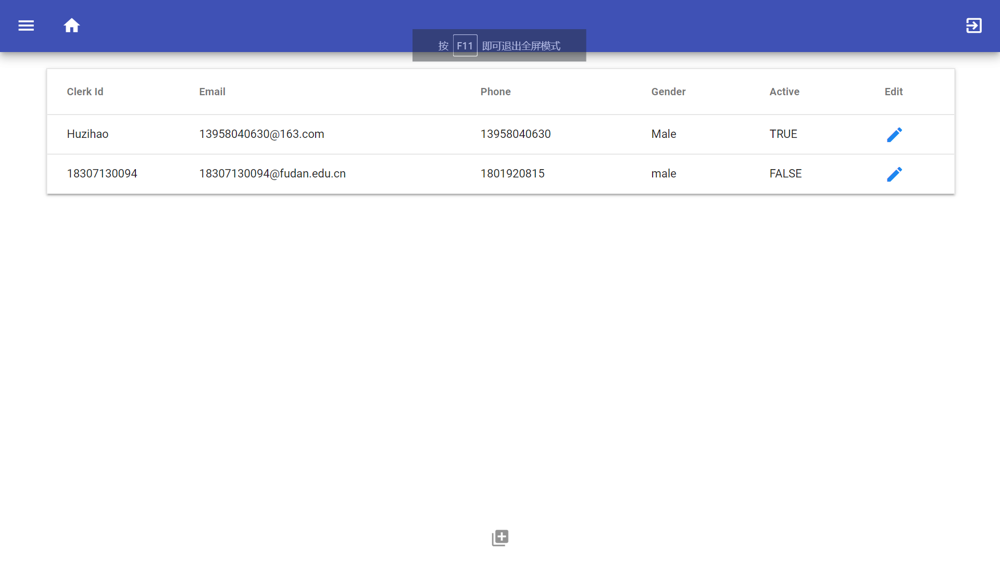
* 点击职员表右侧 edit 符号，进入职员编辑页面，可以增加（删除）职员权限，（别忘了查看职员是否处于激活状态，and不要对没有改过密码的职员激活！）
  
  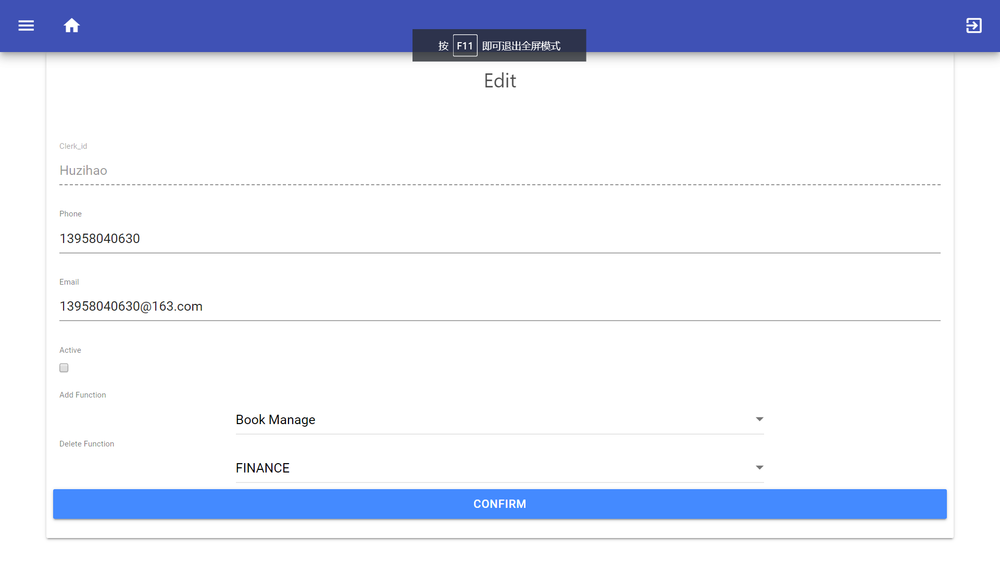


## 五、特色和创新点
* 实现了角色特权分配
* 在一开始就考虑到事务（ 虽然只是非常粗暴的将事务写在了 views 上）
* 以及挂载在自己的服务器上 （ 努力实现中 ）
* 实现了页面自适应（当然我没在手机上登陆过，我仅仅在 google 游览器中按 F12 观察过）
  
  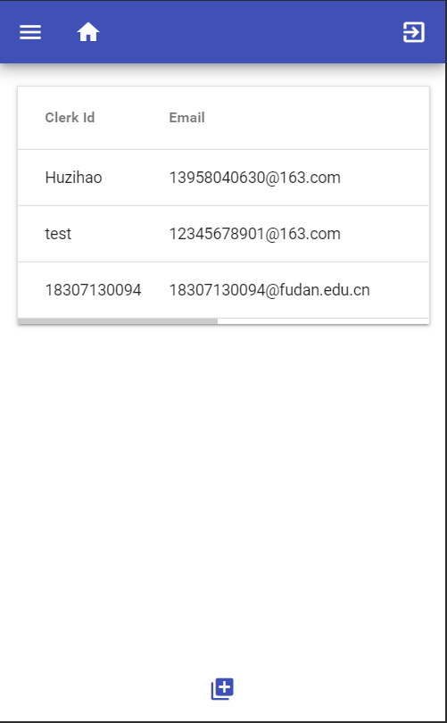
  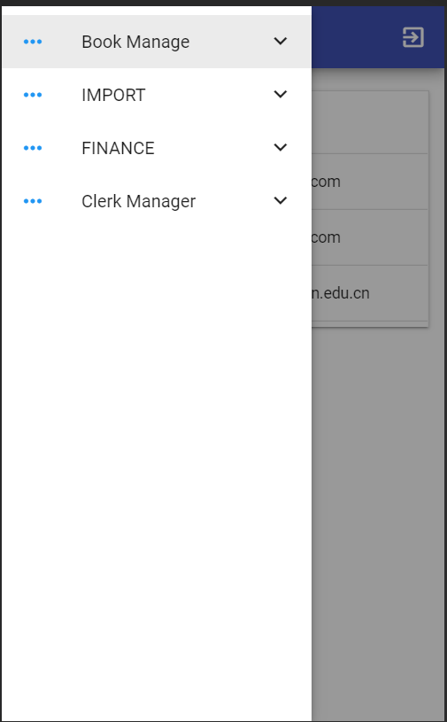


## 六、分工
github + Google + StackOverflow + cnblog + csdn + djangoproject + mdui.org + W3C...... + 陈冠多
## 七、提交文件说明
提交的压缩包应该存有我放入的所有数据，所以可以直接跑起来（或者你可以再创建一个新的用户啥的，嗯）


## 八、实验总结
Totally：写 Web 是个非常曲折的过程。

一开始写这个 PJ 我本来想用 Unity 做前端的（鉴于我上学期合作写了个以 Unity 为前端的 pipe line），但是考虑到这个是个购书用的数据库 PJ 为什么要写个本地跑的软件呢（好吧，unity 能搞出些非常六的操作，但是我拒绝）？而且我想挑战自我，于是果断选择写个 Web 项目。

确定方向后我开始研究如何写一个完整的 Web 项目。好高骛远的我在一开始就决定不用 Python（ 后面就会发现这是多么愚蠢的事情 ），认为 Python 这种所有人都可以快速掌握的胶水语言不适合计算机系的学生。本着年轻就得折腾的原则，我在网友们的建议下，开始了 Java Web 的艰苦奋斗。最初我用的技术栈如下:
- 前端：
  - Vue.js
  - ElementUI
  - axios
- 后端：
  - SpringBoot
  - SpringData + JPA
  - MYSQL
  - Shiro

那是 PJ 才刚刚布置，我认为自己有的是时间，有的是精力，年轻人就应当多学习，多拼搏！于是，我花费了整整一周配置完 Java Web 所需的环境，然后别写边看 js 教程和各种 demo（捂脸）。最终，我在前后交互（ 也就是在写 signup  ）上遭到了制裁（ 大概就是不知道自己错在哪里但就是报错，一个地方卡住 3 天 ），那是，我认识到 ~~“人类是有极限的”~~。 我痛定思痛，大胆的放弃了用 SpringBoot 框架写 PJ 的梦想，重回 Python （可谓人生苦短，我用 Python ）。然后在奇妙 Django 框架下，我花了不到两周从零写出了一个看起来还行的动态网站。

在这次 PJ 中我了解了构建网站的基本框架和思路，比如 url 设计，网络安全，前后交互协议之类的（ 嗯，其实是个似懂非懂的境界。等下，这不是数据库的 PJ 嘛？ ），以及数据库事务的种种。

问题则有：在 clerk 上的 url 函数还没有实现不同特权的 clerk 的判断；页面刷新的问题（在加入权限后页面没有时刷新之类的问题）；数据库应当如何设计（这个是真的难，没有一个优质甲方，永远没法设计出好的数据库——因为没法知道到底要怎样的应用）。以及 robust 完全没有考虑，这个要求过高了，说好的 “数据库基础”  ...
